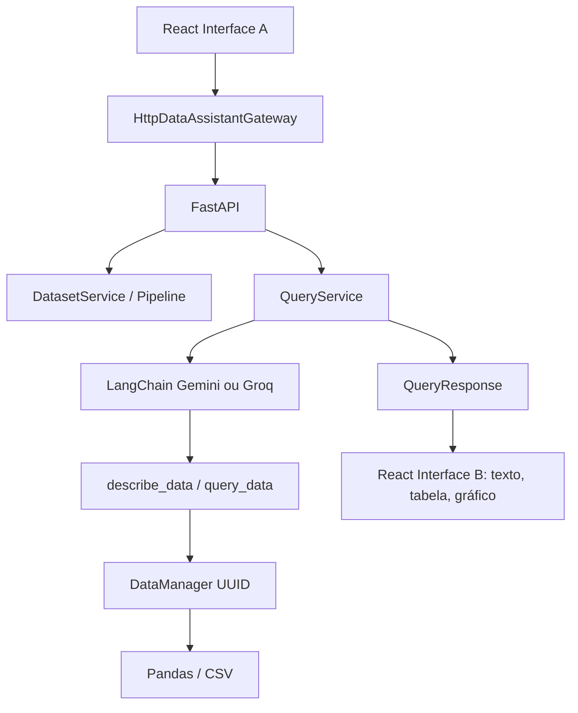

# Relatório Técnico - Desafio I2A2 D4

## Solução e arquitetura

O Data Assistent recebe CSV ou ZIP pela Interface A. O FastAPI cria uma sessão UUID, valida e extrai o conteúdo, reconhece CSVs e `dicionario.csv`. Na Interface B, a pergunta natural chega ao `QueryService`, que orquestra um agente LangChain com `ChatGoogleGenerativeAI` ou `ChatGroq`, conforme configuração. As tools `describe_data` e `query_data` consultam somente o `DataManager` da sessão. O resultado retorna como texto ou contrato estruturado; o frontend deriva tabela e gráfico quando apropriado.



## Framework e agente

LangChain faz o binding de tools e o loop de mensagens. O `SYSTEM_PROMPT` exige descoberta do dataset, nomes exatos de colunas e proíbe invenção de dados. O serviço aplica limite de iterações, timeout, retries e serialização JSON segura. A chave permanece somente no backend.

## ZIP e dicionário

O fixture de certificação contém `compras.csv`, `fornecedores.csv` e `dicionario.csv`, com `arquivo,coluna,descricao`. O dicionário é reconhecido e processado como metadado, não contado como dataset consultável. Traversal, symlink, limites e caminhos Windows/Unix são testados no backend.

## Quatro perguntas reais

Todas foram feitas pelo navegador Playwright contra FastAPI real e agente Groq real, sem interceptação de sucesso:

| # | Pergunta | Esperado | Aplicação | Formato |
| --- | --- | --- | --- | --- |
| 1 | Quantos registros existem no dataset compras? | 4 | 4 | Texto/count |
| 2 | Soma de `valor` por `fornecedor` em compras | Alfa 3500; Beta 1500; Gamma 1000 | Mesmos valores | Texto + tabela + gráfico |
| 3 | Liste as linhas de compras ordenadas por `valor` | Monitor/2500 no topo | Tabela real | Tabela |
| 4 | Quantos registros existem em fornecedores? | 3 | 3 | Texto/count |

As respostas foram calculadas independentemente a partir da fixture e comparadas com os valores renderizados.

## QA e limitações

Backend: 49 testes aprovados. Frontend: 31 testes aprovados, lint e build aprovados. Os cenários Playwright seriais de upload, dicionário e quatro perguntas reais passaram; a execução completa desktop/mobile terminou `9 passed / 5 failed` por `429 RateLimit` externo do Groq. O Gemini configurado retornou `404 NOT_FOUND` para os modelos testados. Por isso o estado formal é **DELIVERY_BLOCKED**, embora os requisitos funcionais tenham evidência via Groq suportado.

Limitações do MVP: registry em memória, datasets perdidos após restart, histórico local e ausência de autenticação/persistência.

## Execução

```bash
python3 -m venv .venv
source .venv/bin/activate
pip install -r requirements.txt
uvicorn api.main:app --reload
cd frontend
npm ci
npm run dev
npm test
npm run lint
npm run build
AI_PROVIDER=groq GROQ_MODEL=llama-3.1-8b-instant npm run e2e
```

`GOOGLE_API_KEY`/`GROQ_API_KEY` ficam somente no backend; `VITE_API_BASE_URL` aponta para a API. Nenhuma chave é colocada no Git.
