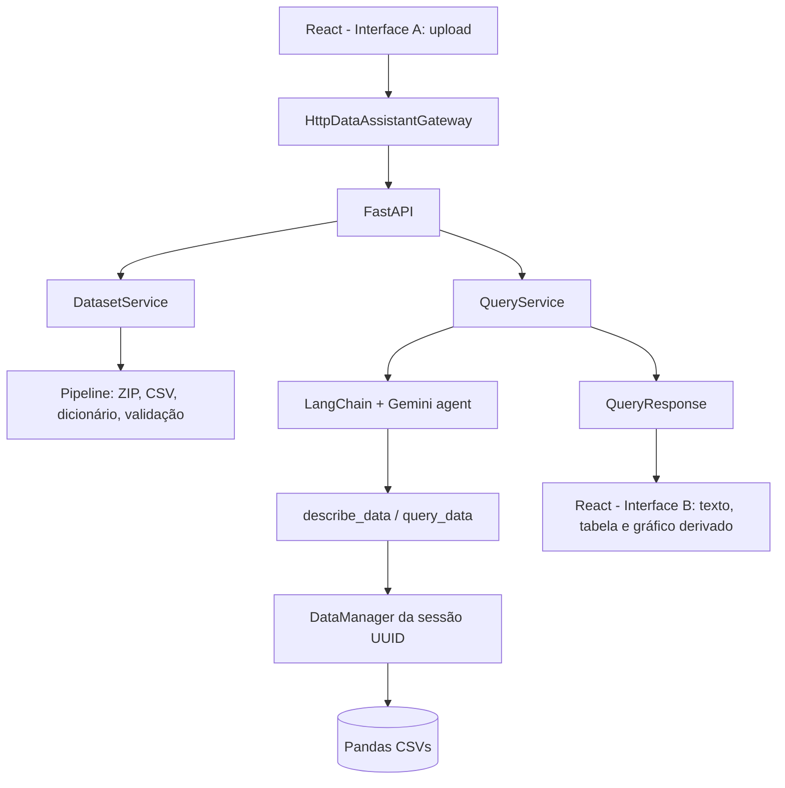

# Arquitetura

O upload é validado, extraído em diretório isolado e processado
síncronamente. `dicionario.csv` é reconhecido como metadado opcional e suas
descrições são incorporadas ao `describe_data`.

O agente recebe `SYSTEM_PROMPT`, escolhe `describe_data` ou `query_data`, recebe
o resultado da ferramenta e produz a resposta final. `QueryService` limita
iterações, timeout e retries. A UI nunca recebe a chave do Gemini.
