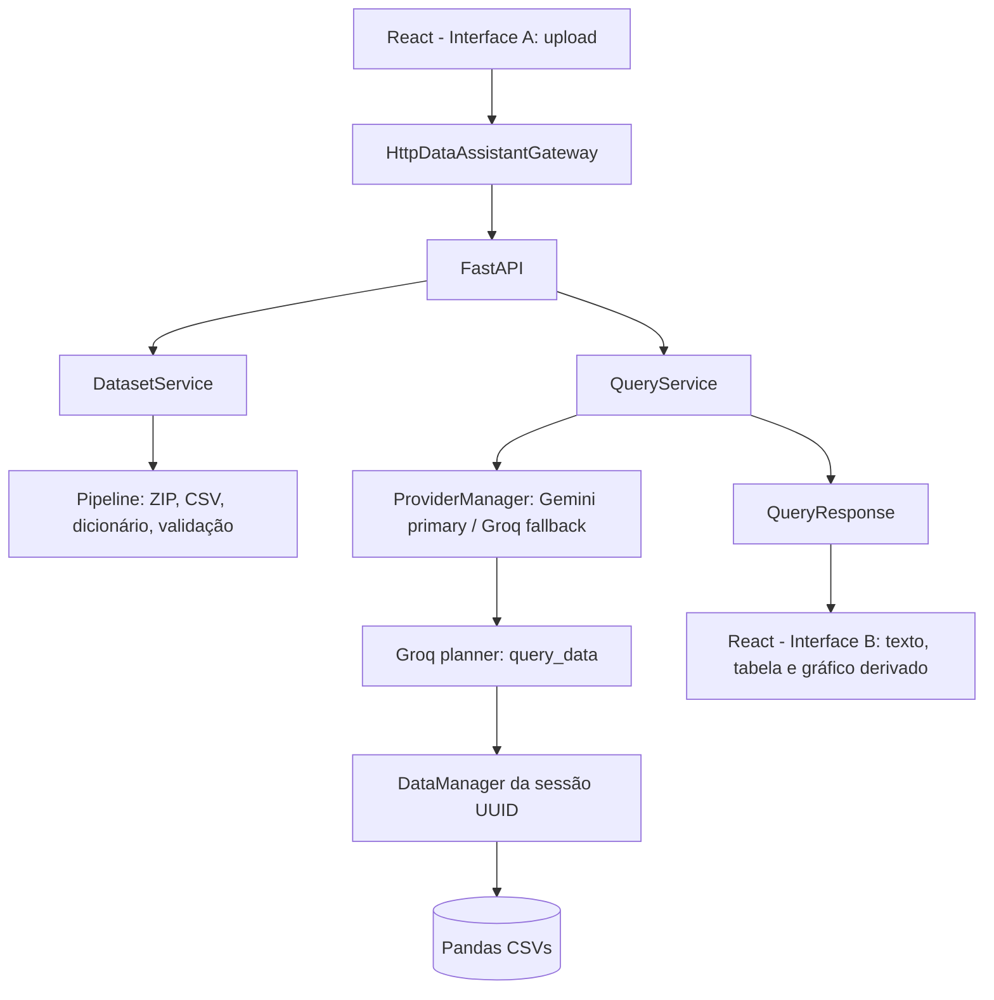

# Arquitetura

O upload é validado, extraído em diretório isolado e processado
síncronamente. `dicionario.csv` é reconhecido como metadado opcional e suas
descrições são incorporadas ao `describe_data`.

Gemini preserva o fluxo de ferramentas existente. O fallback Groq usa
`openai/gpt-oss-20b` (configurável por `GROQ_MODEL`) com reasoning `low` e JSON
Schema estrito para `DataQuery`, sem combinar structured output com tool use. O
Python executa `query_data` e
consulta e monta a resposta sem uma segunda inferencia de redacao. `QueryService`
limita a uma geracao normal no Groq, controla timeout, fallback e telemetria;
resultados nao sao reenviados ao modelo.
Gemini e o provider primario e Groq e o fallback remoto; provider local e uma
extensao futura ainda nao implementada. No caminho Groq, o backend prepara
`planner_context()` com apenas nomes, tipos e descricoes nao vazias. O modelo
recebe somente `query_data` e produz um plano `DataQuery` estruturado em uma
geracao. O `DataManager` valida e executa o plano deterministicamente,
incluindo agregacao, ordenacao e top N. CSV, DataFrame, amostras e historico de
queries nao sao enviados.

Cada consulta recebe `query_id` e cada geracao e registrada com `llm_call_id`,
provider, modelo, iteracao, ferramentas, latencia e usage quando disponivel.
`ProviderHealth` mantem budget TPM/RPM, reserva atomica reconciliada, semaforo de
concorrencia e circuito `CLOSED`, `OPEN`, `HALF_OPEN`. Budget, cooldown e circuito
sao indexados por provider + modelo, portanto o estado do modelo descontinuado
nao bloqueia `openai/gpt-oss-20b`. O estado e em memoria e
nao e distribuido entre workers/processos. 429 nao sofre retry imediato e
reset/retry-after invalidos resultam em cooldown conservador. A UI nunca
recebe nenhuma chave.

Cada tentativa registra `REQUEST_SENT`, `LOCAL_TOKEN_BUDGET_BLOCK`,
`LOCAL_CIRCUIT_OPEN`, `LOCAL_COOLDOWN`, `HTTP_429_PROVIDER`, `HTTP_SUCCESS` ou
`HTTP_OTHER_ERROR`, junto de `provider_called` e timestamps. Headers de limite
sao registrados quando o provider os fornece; ausencia permanece explicita,
sem estimar limites. `scripts/groq_diagnostic.py` faz uma unica chamada HTTP
minima fora do agente para separar quota externa de bloqueio da aplicacao.
